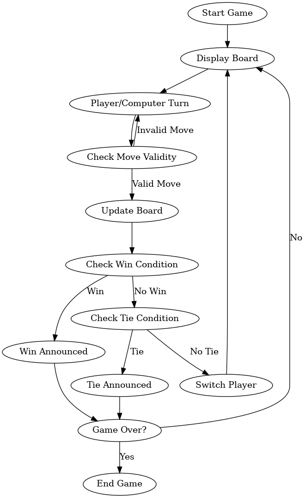

# Tic Tac Toe - Command-Line Application


## Overview
Tic Tac Toe is a classic two-player game implemented as a command-line application. This project was designed to demonstrate programming fundamentals, object-oriented programming (OOP), and clean code practices while creating an engaging and functional application. The project caters to both human players and includes an option to play against a computer opponent with adjustable difficulty.

---

## 1. Logic and Code Efficiency 

### Code Efficiency
The application's logic is broken into small, reusable methods and functions, adhering to the principles of DRY (Don’t Repeat Yourself). The core gameplay loop ensures smooth transitions between player turns, validations for moves, and the game's end conditions.

### Granular Functions
Key functions include:
- **`print_board`**: Displays the game board with emojis for visual clarity.
- **`play_turn`**: Handles individual player or computer moves.
- **`check_winner`**: Determines if there’s a winner based on the current board state.
- **`computer_move`**: Implements AI logic for computer moves (easy or hard).
- **`minimax`**: A recursive algorithm for determining the optimal move in hard difficulty.

This modular structure ensures consistency in logic flow and simplifies testing and debugging.

---

## 2. Programming Fundamentals and OOP 

### Programming Constructs
The project demonstrates:
- Control structures like loops and conditionals for board navigation and move validation.
- Recursive functions for the Minimax algorithm.
- Data structures like lists for representing the game board.

### Object-Oriented Programming
The application is encapsulated within the **`TicTacToe`** class. Key features:
- Encapsulation of game data (e.g., board, players).
- Methods for gameplay and utility, enhancing code reusability.
- Clear relationships between game elements.

This OOP approach ensures scalability and future extensibility, such as integrating a graphical interface or additional game modes.

---

## 3. Easy and Hard Modes

### **Easy Mode**
In Easy Mode, the computer makes random moves by selecting from the available spaces on the board. This approach doesn't consider winning strategies or blocking the opponent, making the computer predictable and easier to beat.

#### **Logic**:
- Identify all empty cells on the board.
- Randomly choose one of these cells for the computer's move.

#### **Implementation**:
- The computer uses Python's `random.choice()` function to pick a move.
- The randomness ensures the computer's moves are not repetitive but also not strategic.

#### **Why Easy?**
- This mode doesn’t use any tactical logic, so it’s ideal for beginners or players who want a casual, relaxed game.

---

### **Hard Mode**
Hard Mode significantly increases the difficulty by implementing the **Minimax algorithm**, a decision-making algorithm often used in game theory and AI to find the optimal move. The computer now plays strategically to win or block the player from winning.

#### **How the Hard Mode Works:**
1. **Logic**:
   - The Minimax algorithm recursively evaluates all possible moves and their outcomes.
   - Assigns a score to each possible game state:
     - **+1**: If the computer wins.
     - **0**: If the game ends in a tie.
     - **-1**: If the player wins.
   - The computer selects the move that maximizes its chances of winning (or minimizes the player's chances of winning).

2. **Strategies Implemented**:
   I researched winning strategies for Tic Tac Toe online and implemented the Minimax algorithm to make the computer unbeatable in Hard mode. These strategies were adapted to suit the project and provide both a fun and challenging experience for players. These were the strategies that I found - 

   - **Win if possible**: The computer checks if there’s a move that leads directly to a win and prioritizes it.
   - **Block opponent’s win**: If the player is about to win, the computer blocks their move.
   - **Play for a tie**: In cases where neither side can win, the computer prioritizes moves that ensure a tie.
   - **Optimize long-term outcomes**: The Minimax algorithm ensures that the computer considers future moves, making it impossible to trick or outsmart in most cases.

---

### **Comparison Between Easy and Hard Modes**

| **Feature**             | **Easy Mode**            | **Hard Mode**           |
|--------------------------|--------------------------|--------------------------|
| **Move Selection**       | Random                  | Optimal (Minimax)        |
| **Win Prioritization**   | No                      | Yes                      |
| **Blocking Player’s Win**| No                      | Yes                      |
| **Long-Term Planning**   | No                      | Yes                      |
| **Difficulty Level**     | Beginner-Friendly       | Challenging              |

---

## 4. Planning and Design 

The project’s logic was planned and visualized using flowcharts and diagrams. These include:
- A flowchart for the game loop, detailing player turns, move validation, and game-end conditions.
- A decision tree outlining the computer's moves based on difficulty.
- Below you can see the flowchart that was made in the planning stage to plan out the functions.


---

## 5. Bugs Encountered and Fixes

---

### **1. Invalid Input for Moves**
**What Happened:**  
During testing, I noticed that when a player entered something like `a 2` or `4 5`, the game crashed with a `ValueError`. It became clear that the program couldn’t handle invalid input gracefully, which would frustrate players.

**How I Fixed It:**  
I added validation to ensure that players could only input two numbers between 1 and 3, separated by a space. If the input was invalid, the game displayed an error message and prompted the player to try again. This made the input process much smoother and crash-free.

---

### **2. Overwriting Existing Moves**
**What Happened:**  
While testing, I realized that players could overwrite moves already made on the board. For instance, Player 2 could place their symbol in a spot already taken by Player 1, breaking the game’s rules.

**How I Fixed It:**  
I updated the logic to check if a cell was already occupied before allowing a move. If the cell was taken, the game would notify the player and ask them to choose another spot. This fix ensured fair gameplay and adhered to the rules of Tic Tac Toe.

---

### **3. Incorrect Win Detection**
**What Happened:**  
At one point, I noticed that the game didn’t recognize a win when a player formed a diagonal line. For example, Player X could form a winning pattern from the top-left to the bottom-right, but the game wouldn’t acknowledge it.

**How I Fixed It:**  
I reviewed the win detection logic and realized it didn’t fully account for diagonals. I added checks for both diagonal win conditions, and after testing, all winning scenarios were recognized correctly.

---

### **4. Game Doesn't End on Tie**
**What Happened:**  
In a test game, the board filled up completely without a winner, but the game didn’t end. It just kept asking for more moves, even though there were no spaces left to play.

**How I Fixed It:**  
I added a condition to check for a full board after each turn. If it was, the game declared a tie and ended immediately. This ensured that the game handled ties properly.

### **5. Center or Corner Strategy Fails in Hard Mode**
**What Happened:**  
While testing Hard mode, I realized the AI wasn’t prioritizing strategic moves. For example, it would choose an edge cell instead of the center or a corner, making it easier for the player to win.

**How I Fixed It:**  
I modified the AI’s logic to prioritize the center first, then the corners, and finally the edges. This small change made the AI much more competitive and aligned with optimal Tic Tac Toe strategies.

### **6. Input Not Recognized on Some Platforms**
**What Happened:**  
When testing the game on Linux, I found that the input prompt didn’t behave as expected. It either ignored the input or caused an error, even though the same code worked perfectly on Windows.

**How I Fixed It:**  
I standardized the input handling across platforms by testing and adjusting the input logic for compatibility. After that, the game worked seamlessly on all systems I tested it on.

---

### **7. Game State Not Reset Between Rounds**
**What Happened:**  
After finishing a game and selecting "Play Again," I noticed that the board still showed the previous game’s state. The players’ turns also didn’t reset, which caused confusion and made the new game unplayable.

**How I Fixed It:**  
I implemented a `reset_board` function to clear the board and reset the turn order before starting a new game. This ensured that every new round started with a clean slate.

---

### **8. AI Moves on a Full Board**
**What Happened:**  
During one test, the AI attempted to make a move when the board was already full, resulting in an error. It seemed that the AI didn’t account for the board being completely occupied.

**How I Fixed It:**  
I added a check to ensure the board had available spaces before allowing the AI to make a move. If the board was full, the game declared a tie and ended as expected.

---

### **9. Unclear Turn Display**
**What Happened:**  
In Human vs Human mode, I found that players sometimes didn’t know whose turn it was. The game only showed the board, so they had to guess based on the last move.

**How I Fixed It:**  
I updated the game to clearly display the current player’s name and symbol at the start of each turn. This small change improved the game’s flow and made it easier for players to stay engaged.

These were some of the key challenges I encountered during development. Fixing them not only resolved the issues but also enhanced the overall user experience, ensuring smoother and more enjoyable gameplay.

### There are no remaining bugs

## 6. Validation and Testing

### Validation Fixes
Common validation issues addressed:
- Preventing players from selecting already occupied cells.
- Ensuring valid input (e.g., numbers between 1 and 3 for row and column).
- Fixing edge cases where Minimax logic caused errors.

### Manual Testing
The application was tested manually, including:
- Simulating all possible win conditions (rows, columns, diagonals).
- Testing tie conditions.
- Switching between game modes and difficulties.

PEP 8 validation was used to ensure compliance with Python’s coding standards.

# Validation Table for `run.py`

| **Input Type**               | **Validation Criteria**                                                                                      | **Outcome**                                                                                                                                                           | **Error Handled**                                                                                          |
|-------------------------------|-------------------------------------------------------------------------------------------------------------|-----------------------------------------------------------------------------------------------------------------------------------------------------------------------|------------------------------------------------------------------------------------------------------------|
| **Move Input (row and col)**  | Must be two integers between 1 and 3, separated by a space.                                                 | Valid move: Updates the board with the player's symbol.                                                                                                               | Invalid input: Displays error message ("Invalid input! Please enter two numbers separated by a space.") and prompts for re-entry.               |
|                               | Cell must not already be occupied.                                                                          | Valid move: Cell updated with the player's symbol.                                                                                                                    | Cell occupied: Displays error message ("Invalid move! That cell is already taken.") and prompts for another input.                              |
| **Game Mode Selection**       | Input must be "1" (Human vs Human) or "2" (Human vs Computer).                                              | Valid input: Proceeds to the next step (setup or difficulty selection).                                                                                               | Invalid input: Prompts user to enter a valid choice.                                                                                            |
| **Difficulty Selection**      | Input must be "1" (Easy) or "2" (Hard) when Human vs Computer mode is selected.                             | Valid input: Sets difficulty level to Easy or Hard.                                                                                                                   | Invalid input: Displays error message ("Invalid choice. Please select either 1 (Easy) or 2 (Hard).") and prompts for re-entry.                  |
| **Post-Game Options**         | Input must be "1" (Return to start), "2" (Play again), or "3" (Exit).                                       | Valid input: Executes the chosen option (restarts game, starts a new game, or exits the program).                                                                     | Invalid input: Displays error message ("Invalid choice! Exiting...") and terminates the program.                                                |
| **Player Names**              | Input must be a non-empty string for each player name.                                                      | Valid input: Stores names as `player_names`.                                                                                                                          | Empty input: Defaults to "Player 1" and "Player 2" if no name is entered.                                                                       |
| **Computer Move (Easy)**      | Randomly selects an empty cell from the board.                                                              | Valid input: Cell chosen and marked with computer's symbol.                                                                                                           | Full board: No valid moves left; game ends in a tie.                                                                                            |
| **Computer Move (Hard)**      | Evaluates moves using Minimax algorithm and selects the optimal move.                                       | Valid move: Cell chosen based on best score from Minimax evaluation.                                                                                                  | Full board: No valid moves left; game ends in a tie.                                                                                            |
| **Win Detection**             | Checks rows, columns, and diagonals for three matching symbols.                                             | Winning condition detected: Declares the winner and displays appropriate message.                                                                                     | None (all cases are handled in the win-check logic).                                                                                            |
| **Tie Detection**             | Checks if all cells on the board are filled and no winner is detected.                                      | Tie condition detected: Declares a tie and displays a message.                                                                                                        | None (tie condition is built into the game loop).                                                                                               |

---

### Notes:
- **Error Handling:** The application ensures graceful error handling for all possible invalid inputs, guiding the user back to the correct flow of the game.
- **Outcomes:** All valid inputs result in clear outcomes, such as board updates, game progression, or appropriate messages for winning/tie scenarios.
- **Future Improvements:** Adding custom error messages for specific edge cases (e.g., no valid moves for AI) could improve user feedback further.


**Placeholder Screenshot:**


---

## 7. Possible Future Updates
#### Larger Board Sizes
- Description: Allow players to choose from different board sizes (e.g., 4x4, 5x5) with adjusted win conditions (e.g., 4 in a row for larger boards).
- Benefit: Adds variety and makes the game more challenging.
- Implementation Idea: Dynamically generate the board and modify the win-checking logic to support different dimensions.

#### Scoring System
- Description: Implement a scoring mechanism to track wins, losses, and ties across multiple games.
- Benefit: Encourages competition and replayability.
 -Implementation Idea: Store scores in a file or a database and display them after each game or in a leaderboard.

#### Alternate Game Modes
Update: Introduce new modes to keep the game fresh, such as:
- Timed Mode: Players must make moves within a time limit.
- Reverse Mode: The player who forces the other to win loses.
- Benefit: Adds variety and unique challenges to the game.


## 8. Code Attribution 

All code was written from scratch except for references to:
- The Minimax algorithm, which was adapted from open-source resources and modified for this project.

These external sources were clearly separated and cited in the code comments.

---

## 8. Deployment Procedure 

### Steps to Deploy the Project to Heroku

1. **Push the Code to GitHub**:
   - Commit and push all changes to your GitHub repository:
     ```bash
     git add .
     git commit -m "Prepare for Heroku deployment"
     git push 
     ```
   
   **Placeholder Screenshot:**
   

2. **Create a Heroku App**:
   - Log in to your Heroku account and create a new app from the Heroku dashboard.
   - Choose a unique name for your app and select the appropriate region.
   
   **Placeholder Screenshot:**
   

3. **Deploy the App**:
   - Connect your Heroku app to your GitHub repository via the **Deployment Method** section.
   - Enable automatic or manual deployment from the desired branch (e.g., `main`).
   
   **Placeholder Screenshot:**
   

4. **Run the Application**:
   - After deployment, click **Open App** in the Heroku dashboard to run the application.
   
   **Placeholder Screenshot:**
   

5. **Live Link**:
   The live version of the application can be accessed at:  
   [**Tic Tac Toe on Heroku**](https://your-app-name.herokuapp.com)

---

## Conclusion
The Tic Tac Toe project showcases programming fundamentals, OOP principles, and a clean, modular code structure. Its simple yet effective design makes it both an educational tool and an entertaining application.
